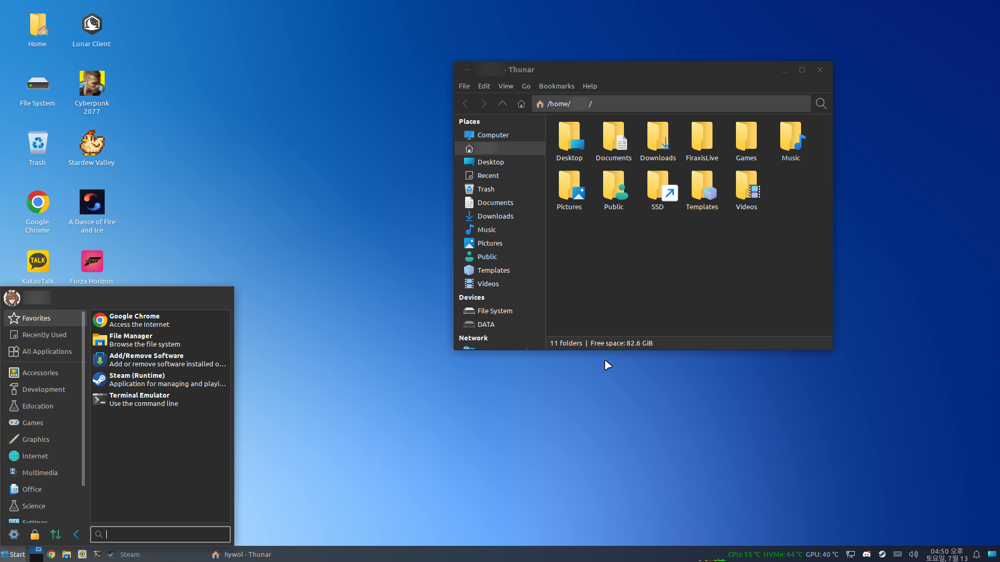

# RedmondX-icon-theme
Fluent Design icon theme for Linux Desktop

## Sources

* Fluent-icon-theme
* We10X-icon-theme
* Eleven-icon-theme

## Features

* Windows 1x(10, 10X, 11) icons Complications
* Windows 10 Folder Style with Fluent Design

## Screenshots

* KDE

* Xfce

